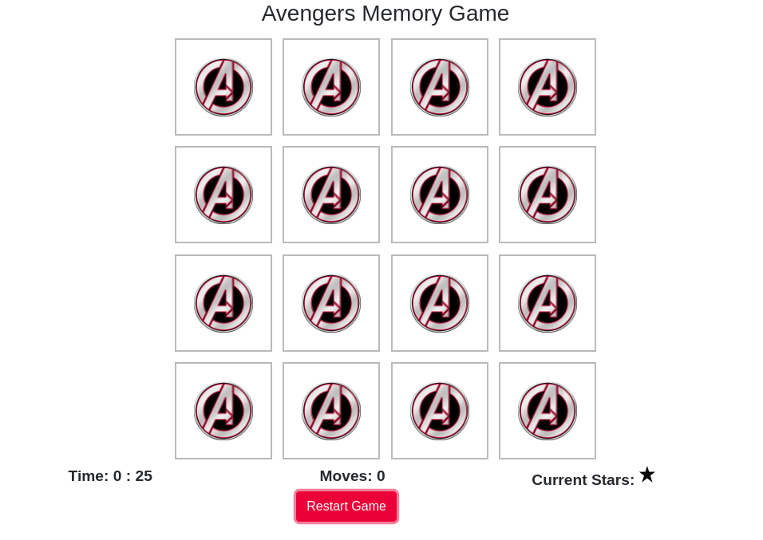
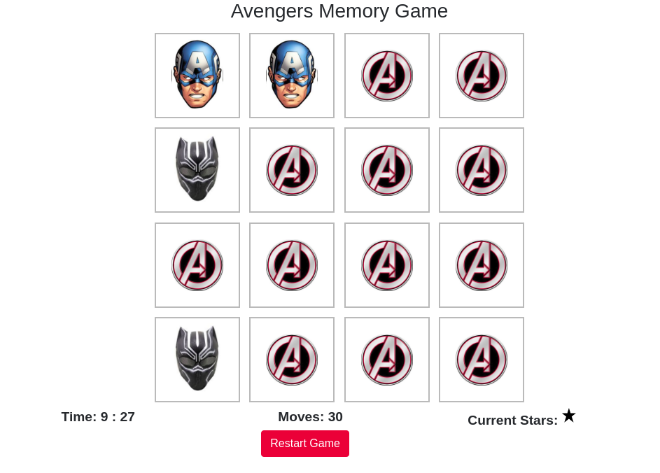
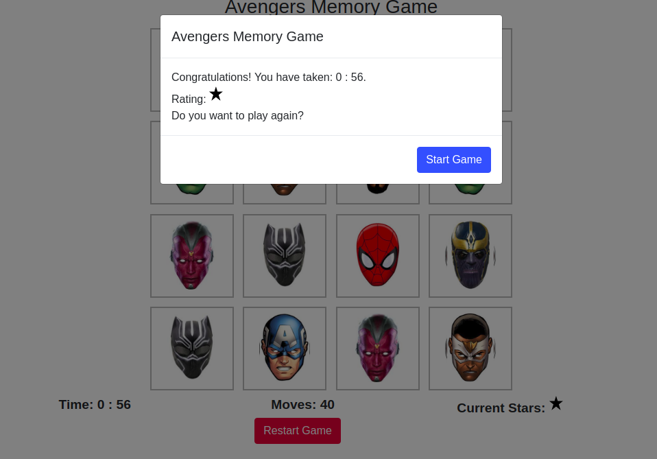

# Avengers Memory Game
Browser-based card matching game. Sometimes also known as `Concentration`.

## How to play
The game board consists of sixteen cards arranged randomly in a grid. The deck is made up of eight different pairs of cards, each with different avenger face on one side.
 - A player flips one card over to reveal its underlying avenger.
 - The player then turns over a second card, trying to find the corresponding card with the same avenger.
 - If the cards match, both cards stay flipped over
 - If the cards do not match, both cards flipped back.

## Dependencies
External libraries used in this project are:
 - Jquery
 - Bootstrap

## Contributing
How to run the project locally:
 - clone the repo.
 - and just run index.html on your browser.

## Screen Shots
Start

middle of the game

Winning state

## Licence
MIT licence
